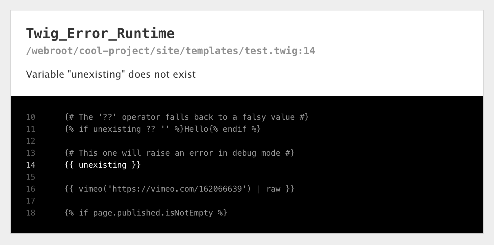

Twig Plugin for Kirby CMS
=========================

<figure>
  
</figure>

-   Adds support for [Twig templates](http://twig.sensiolabs.org/) to [Kirby CMS](https://getkirby.com/).
-   Requires Kirby 2.3 (in beta as of 2016-04-12).
-   PHP templates still work, you don’t have to rewrite them if you don’t want to. (Note: if both `mytemplate.twig` and `mytemplate.php` exist, the Twig template is used.)


What it looks like
------------------

Before:

```php
<?php /* site/templates/hello.php */ ?>
<h1><?php echo $page->title() ?></h1>
<?php echo $page->text()->markdown() ?>
```

After:

```twig
{# site/templates/hello.twig #}
<h1>{{ page.title }}</h1>
{{ page.text.markdown | raw }}
```


Installation
------------

If you’re using [Kirby’s CLI](https://github.com/getkirby/cli), you can install with:

```
kirby plugin:install fvsch/kirby-twig
```

For manual installation:

1. Download [the latest release](https://github.com/fvsch/kirby-twig/releases) and put it in your `site/plugins` folder.
2. Rename the copied folder to `twig` (it should be named `site/plugins/twig`).
3. To activate the plugin, put `c::set('twig', true);` in your `site/config/config.php`.

You can now create `.twig` templates in your `site/templates` directory.

See [Twig templating tips for Kirby](doc/templating.md) for examples and some advice on using Twig with Kirby.


Options
-------

```php
// REQUIRED: activate Twig plugin
c::set('twig', true);

// Should we use .php templates as fallback when .twig
// templates don't exist? Set to false to only allow Twig templates
c::set('twig.usephp', true);

// Kirby URI of a page to render when there is a Twig error in production
// For instance 'error/system'. Falls back to c::get('error').
c::set('twig.error', '');

// Use Twig’s PHP cache?
// (Note that Kirby has its own HTML cache.)
c::set('twig.cache', false);

// Disable autoescaping or specify autoescaping type
// http://twig.sensiolabs.org/doc/api.html#environment-options
c::set('twig.autoescape', true);

// Should Twig throw errors when using undefined variables or methods?
// Defaults to the value of the 'debug' option
c::set('twig.strict', c::get('debug', false));

// List of additional functions that should be available in templates
c::set('twig.env.functions', ['myCustomFunction']);

// List of classes that can be instantiated from templates (with the `new()` function)
c::set('twig.env.functions', ['SomeClass']);
```


## Known limitations

1.  Only a subset of Kirby’s functions and helpers are exposed to Twig templates. The `$page`, `$pages` and `$site` objects are available (as `page`, `pages` and `site`), but only a fraction of Kirby’s many helper functions are. See [doc/templating.md](doc/templating.md) for more info.

2.  By design, Twig will *not* let you include files from outside the `site/templates` directory (except with the `snippet()` function). If you have a use case where this is a problem, please open an issue.


## Displaying errors

With PHP templates, most errors are shown directly in the page. Things are a bit different with Twig: if an error is not suppressed, the template will *not* be rendered at all, and you end up with an error page.

This plugin uses the value of the `debug` option (`c::get('debug')`) to know how strict it should be with errors and how much information to display.

#### In production (no debug)

1.  Undefined variables and methods are ignored, so they don’t raise an error.
2.  For other errors, an error page will be shown, and it will have very little information about the source of the error (it doesn’t mention Twig, template names, etc.). We will show the error page (`c::get('error')`) if it exists, or a very short message otherwise.

#### In debug mode

-   Undefined variables and methods raise an error (see the config section if you want to change that).
-   A nice error page is shown, with an excerpt of the faulty template code.

<figure>
    
</figure>


## Alternative installation methods

-   Installing with the [Kirby CLI](https://github.com/getkirby/cli) should work, but hasn’t been tested yet.
-   If you wish to install with Composer instead, see [Installing with Composer](doc/composer.md).


## License

-   This script: [MIT License](LICENSE)
-   Twig library: see [lib/Twig/LICENSE](lib/Twig/LICENSE)
